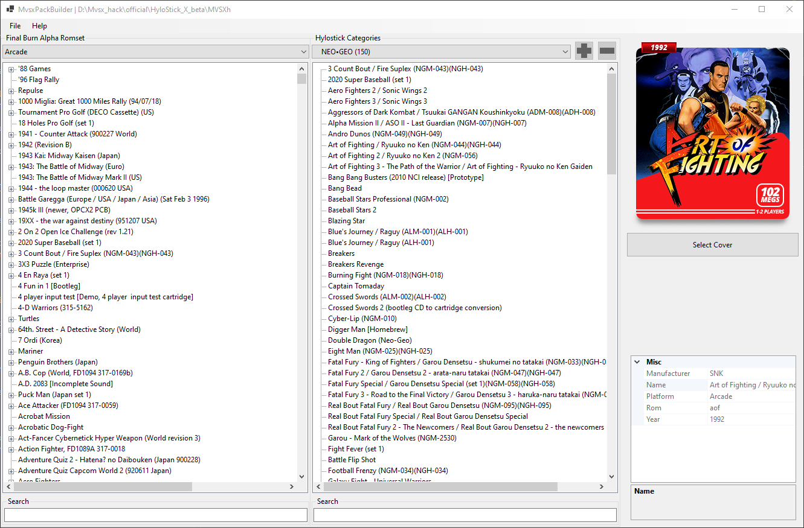

# MvsxPackBuilder
 A GUI to manage ROMs with the HyloX MVSX hack.

## Installation
Simply unzip a release somewhere in your computer.

## Usage
Using the app is straightforward, the left panel is your FBA romset, the right panel is your HyloX game list.

You can add a game by right-clicking on an FBA game to add it to the HyloX game list.  
You can remove a game by right-clicking on a game in the HyloX game list.

Using the search field, you can quickly filter the games in the dataset.

Once you are happy with your game list, you can export it to your MVSXh folder.

The export process works as follow:
- Update the gamesX.ini 
- Copy the roms and dependencies (parent roms) to the correct output folder.
- Copy and resize the cover art to the correct output folder. 

MVSX Pack Builder does not delete any file in the HyloX installation, so it should be relatively safe.  
I am not responsible if this brick your MVSX, USE AT YOUR OWN RISK!

### Setting up the FBA romset path

First, you need to provide a valid Final Burn Alpha 0.2.97.43 romset.  
The expected romset directory structure is as follow:

    fba
    +--- roms
    +--- megadriv

You need to specify where the fba romset is on your computer using the "Set Fba Roms Folder" from the file menu.  
Once you have selected a valid romset folder, the "Final Burn Alpha Romset" list *should* show all valid games.  

Games names that are displayed with a strikeout indicate that the rom is missing.  
Games name that have a strikeout and highlighted red indicate that the rom is from an incompatible FBA romset. (this feature is currently disabled)  
You can hover the game name for more information about the errors.

### Setting up the HyloX path

You need to specify where your HyloX install is located using the "Open MVSX Hack Folder" under the file menu.  
Once you have selected a valid installation, the games will appear in the right-hand panel.

## Frequently Asked Questions
- Where do I find the roms?
    - You will need to source a Final Burn Alpha 0.2.97.43 romset, this is the version compatible with the MVSX HyloX hack.
- Where do I find the cover art?
    - There are plenty of resources online that have cover art for the Final Burn Alpha, the libretro-thumbnails GitHub repository is a good resource.
- What about the Genesis/Megadrive games?
    - Genesis/Megadrive games are supported by MVSX Pack Builder, just select Megadrive in the Final Burn Alpha Romset drop down to be able to select and add them.
- What about PC-Engine / SuperGrafx / TurboGrafx16?
    - While these platforms are supported by the MVSX HyloX hack, their performance is so poor that support is disabled in MVSX Pack Builder. 
- Does this work with the Hylo ASP hack?
    - No idea, I do not own an ASP nor have I seen the Hylo ASP hack.
- Why is game X not working/too slow/unplayable
    - No idea, the MVSX hardware is not particularly powerful and the FBA version used by HyloX has issues with certain games.
- Are all the games in the FBA Romset playable?
    - No, only a limited subset actually works, NEOGEO / CPS works well, anything else is touch and go.
  
## TODO
- [x] Publish initial version
- [ ] Improve HyloX categories management
- [ ] Add sorting options
- [ ] Finish FBA roms CRC validation
- [ ] Add option to hide "unavailable" games in the FBA list

## Roadmap
I am not planning on adding many more features to this, as it does what I wanted it to do.  
That being said, I will add some small quality of life features (see TODO), free time depending.  
The code is open source, you are welcome to submit a PR.

## Disclaimer
The code within this repository comes with no guarantee, the use of this code is your responsibility.

I take NO responsibility and/or liability for how you choose to use any of the source code available here. By using any of the files available in this repository, you understand that you are AGREEING TO USE AT YOUR OWN RISK. ALL files available here are for EDUCATION and/or RESEARCH purposes ONLY.

## License
[Apache License 2.0](https://choosealicense.com/licenses/apache-2.0/)

